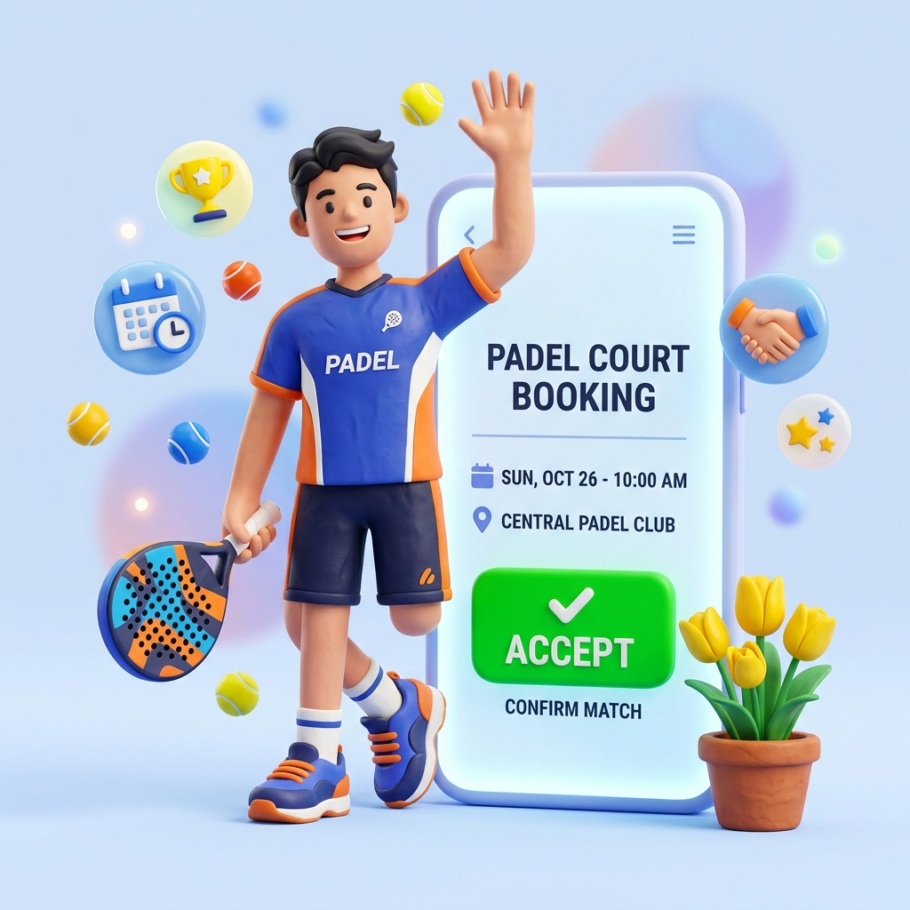

<div align="center">

# 🎾 PadelCourt Hub
### *Modern Digital Platform for Padel Court Booking & Match Management*

[](https://padelcourthub.vercel.app/)
[](https://laravel.com)
[](https://react.dev)
[](https://www.typescriptlang.org/)
[](https://tailwindcss.com/)
[](https://phpunit.de/)

<br />



<br />

**PadelCourt Hub** adalah aplikasi web modern berbasis **Laravel 12 + React 18 (Inertia.js)** yang memudahkan para pencinta olahraga padel untuk menemukan venue, mengecek ketersediaan lapangan secara *real-time*, melakukan booking slot per jam, serta menyelesaikan pembayaran online secara instan.

[🌐 **Jelajahi Live Demo**](https://padelcourthub.vercel.app/) • [⚡ **Akun Demo**](#-akun-demo-1-click-login) • [🚀 **Panduan Instalasi**](#-panduan-instalasi-lokal)

---

</div>

## 📌 Daftar Isi
- [✨ Highlight & Keunggulan](#-highlight--keunggulan)
- [📱 Fitur Customer / Pemain](#-fitur-customer--pemain)
- [🛡️ Fitur Admin & Manajemen](#️-fitur-admin--manajemen)
- [🏗️ Arsitektur & Tech Stack](#️-arsitektur--tech-stack)
- [🔑 Akun Demo (1-Click Login)](#-akun-demo-1-click-login)
- [🚀 Panduan Instalasi Lokal](#-panduan-instalasi-lokal)
- [🧪 Pengujian & Testing](#-pengujian--testing)
- [📄 Lisensi](#-lisensi)

---

## ✨ Highlight & Keunggulan

| 🌟 Fitur | 📝 Deskripsi |
| :--- | :--- |
| **⚡ Real-Time Availability Matrix** | Pengecekan ketersediaan jadwal lapangan per jam (06:00 – 23:00 WIB) dengan sinkronisasi zona waktu instan. |
| **🎨 3D Claymorphic Auth Portal** | Desain portal login dan registrasi split-card yang modern, estetik, dan responsif di semua perangkat. |
| **💳 Simulator Pembayaran Terpadu** | Simulasi pembayaran instan (BCA Virtual Account, Mandiri, BRI, QRIS Gopay/OVO, & Kartu Kredit). |
| **🎟️ Sistem Voucher & Diskon Dinamis** | Validasi kode promo persentase / nominal dengan kalkulasi otomatis dan aturan minimum belanja. |
| **🎫 E-Ticket & QR Pass** | QR Code check-in siap scan di venue dengan format cetak printer/PDF yang rapi. |
| **📊 Dashboard Eksekutif Admin** | Grafik riwayat pendapatan 7 hari, monitoring booking real-time, dan manajemen CRUD lengkap. |

---

## 📱 Fitur Customer / Pemain

> **Alur Booking**: **1. 🔍 Cari Venue** ➔ **2. 📅 Pilih Slot Jam** ➔ **3. 🎟️ Masukkan Promo** ➔ **4. 💳 Checkout & Bayar** ➔ **5. 🎫 E-Ticket & QR Pass**

- **🏠 Beranda Interaktif**:
  - Filter pencarian cepat berdasarkan kota, tanggal, jam mulai, dan durasi.
  - Metrik live: Total Lapangan Aktif, Total Venue, Total Booking Sukses, dan Rata-rata Rating.
  - Katalog Venue Populer dengan fasilitas (Indoor/Outdoor, AC Lounge, Pro Shop, Cafe).
- **🏟️ Detail Venue & Galeri Foto**:
  - Galeri visual autentik lapangan padel (Mondo Blue Turf, Dinding Kaca 12mm, Lampu LED Anti-Glare).
  - Pilihan court dengan spesifikasi teknis dan rating ulasan pengguna.
- **📅 Booking & Ketersediaan Slot**:
  - Matriks slot per jam dengan deteksi jam lampau (*past slots*).
  - Skema harga pintar (Weekday Pagi, Weekday Malam / Prime Time, dan Weekend).
  - Proteksi anti *double-booking* menggunakan database transaction locking.
- **🎟️ Voucher Promo**:
  - Halaman katalog promo aktif dengan fitur *1-click copy code*.
- **🎫 E-Ticket & Riwayat Bermain**:
  - Status pesanan transparan (*Pending*, *Confirmed*, *Completed*, *Cancelled*).
  - Tiket digital dengan QR Code unik dan tombol cetak bukti pemesanan.
  - Fitur kirim rating bintang & ulasan setelah sesi bermain selesai.

---

## 🛡️ Fitur Admin & Manajemen

- **📊 Dashboard Analytics**:
  - Ringkasan omzet bulanan, total booking aktif, jumlah pelanggan terdaftar, dan performa venue.
  - Grafik tren pendapatan harian interaktif.
- **🏢 Manajemen Venue (CRUD)**:
  - Kelola data venue, titik alamat, jam operasional, upload foto cover, dan daftar fasilitas.
- **🎾 Manajemen Lapangan (Courts)**:
  - Tambah/edit lapangan (Indoor / Outdoor), status ketersediaan, serta konfigurasi tarif fleksibel.
- **📋 Manajemen Booking**:
  - Monitoring seluruh transaksi masuk dengan filter status dan aksi approval cepat.
- **🎁 Manajemen Voucher Promo**:
  - Pembuatan kode promo dengan batasan kuota, masa berlaku, dan minimal transaksi.
- **👥 Manajemen Pelanggan**:
  - Database customer beserta akumulasi pemesanan dan total pengeluaran.

---

## 🏗️ Arsitektur & Tech Stack

```
PadelCourt Hub
├── 🐘 Backend         : Laravel 12 (PHP 8.2+)
├── ⚛️ Frontend        : React 18 + Inertia.js + TypeScript
├── 🎨 Styling         : Tailwind CSS + PostCSS
├── 🗄️ Database        : SQLite / MySQL / PostgreSQL
├── 📦 Icons           : Lucide React
├── ⚡ Build Tool      : Vite 5
└── ☁️ Cloud Deploy    : Vercel Serverless Platform
```

---

## 🔑 Akun Demo (1-Click Login)

Di halaman login telah disediakan tombol **1-Click Demo** untuk pengujian langsung tanpa perlu mengetik manual:

| 🎭 Role | 📧 Alamat Email | 🔒 Kata Sandi | 🎯 Hak Akses |
| :--- | :--- | :--- | :--- |
| **🛡️ Admin** | `admin@padelcourt.id` | `password` | Akses penuh dashboard admin & seluruh manajemen data |
| **👤 Customer** | `daffa@padelcourt.id` | `password` | Booking lapangan, bayar pesanan, riwayat tiket, review |

---

## 🚀 Panduan Instalasi Lokal

### 📋 Prasyarat
- PHP >= 8.2
- Composer
- Node.js >= 18.x & NPM

### 📥 Langkah Instalasi

1. **Clone repositori**:
   ```bash
   git clone https://github.com/daffaaamd/padelcourthub.git
   cd padelcourthub
   ```

2. **Install dependensi PHP & JavaScript**:
   ```bash
   composer install
   npm install
   ```

3. **Konfigurasi Environment**:
   ```bash
   cp .env.example .env
   php artisan key:generate
   ```

4. **Jalankan Migrasi & Database Seeder**:
   ```bash
   php artisan migrate:fresh --seed
   ```

5. **Build Asset Frontend**:
   ```bash
   npm run build
   # atau untuk mode development:
   npm run dev
   ```

6. **Jalankan Server Lokal**:
   ```bash
   php artisan serve
   ```
   Buka browser dan akses **`http://127.0.0.1:8000`**.

---

## 🧪 Pengujian & Testing

Project ini dilengkapi dengan automated test suite lengkap untuk memvalidasi alur autentikasi, kalkulasi harga, ketersediaan slot, dan transaksi booking:

```bash
php artisan test
```

```
   PASS  Tests\Unit\ExampleTest
   ✓ that true is true

   PASS  Tests\Feature\PadelCourtTest
   ✓ home page renders successfully
   ✓ venues index page loads
   ✓ venue detail page loads with courts
   ✓ court availability returns correct hourly slots
   ✓ promo code validation works
   ✓ booking creation and payment flow completes
   ✓ e ticket QR code renders properly
   ...
   Tests:    44 passed (189 assertions)
   Duration: 2.35s
```

---

## 📄 Lisensi

Proyek ini bersifat open-source dan dilisensikan di bawah [MIT License](LICENSE).

<div align="center">

Dibuat dengan ❤️ untuk kemajuan komunitas olahraga Padel Indonesia 🇮🇩

[⭐ Beri Star di GitHub](https://github.com/daffaaamd/padelcourthub)

</div>
